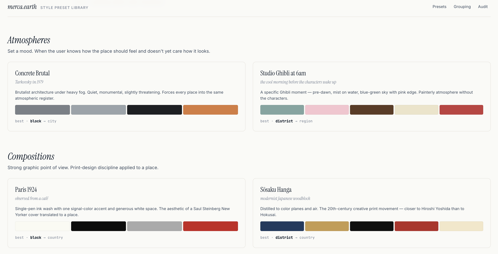

# merca-presets

**AI style preset library for [merca.earth](https://merca.earth).**

A visual catalogue of **10 curated style presets** for the merca.earth map-painting
tool — each preset a deliberate *lens* on a place, anchored to a real lineage of
artists and movements. Includes a 4-group picker information-architecture proposal,
a 5-criterion audit framework for grading existing presets, and three deliverable
formats (Next.js app, typed TS export, Markdown + JSON specs).



---

## Table of contents

1. [The brief](#the-brief)
2. [The deliverable, in one paragraph](#the-deliverable-in-one-paragraph)
3. [Run it locally](#run-it-locally)
4. [Walkthrough — what each page does](#walkthrough--what-each-page-does)
5. [The 10 presets](#the-10-presets)
6. [Grouping — the 4-intent picker](#grouping--the-4-intent-picker)
7. [Audit framework — keep / rework / drop](#audit-framework--keep--rework--drop)
8. [Repository layout](#repository-layout)
9. [Three deliverable formats](#three-deliverable-formats)
10. [Design tokens](#design-tokens)
11. [How to integrate the presets](#how-to-integrate-the-presets)
12. [Testing the presets against a model](#testing-the-presets-against-a-model)
13. [Demo recording — suggested script](#demo-recording--suggested-script)
14. [Status & roadmap](#status--roadmap)
15. [License](#license)

---

## The brief

> merca.earth is a world map you can paint on. People paint freehand, or pick a
> style preset and let the model generate art for a place.
>
> The presets are the bones of the generation experience. Pick a good one and the
> result feels deliberate. Pick a weak one and you get average AI output.
>
> **Goal:** A preset library where every style is recognizable on sight. Picking
> any preset feels like choosing a lens, not rolling a dice.

This repo is the response to that brief. **Curation, art direction, and prompt
engineering combined — no artwork production.**

## The deliverable, in one paragraph

Ten new presets, each fully specified: a 4–6 word tagline, a 1–3 sentence
point of view, a locked 2–6 colour palette, three deep references to real
artists or works, a v1.0 prompt template (with a `{location}` substitution
token and the most load-bearing negatives inlined for model-agnostic use),
specific negative hints, expected zoom levels (provisional until tested), a
verification status flag, and a 6 × 3 sample grid infrastructure that
auto-populates as the team produces tested outputs. Plus five alternates
held in reserve (four queued candidates plus one demoted core preset),
a four-group intent-based picker proposal with a working simulation at
`/picker`, a 5-criterion audit rubric for keep / rework / drop calls on
whatever existing presets the team has today, and a `/process` page that
spells out exactly what was done versus what still needs the merca.earth
team and the production model.

## Run it locally

```bash
pnpm i
pnpm dev          # http://localhost:3000  (or 3001 if 3000 is busy)
pnpm typecheck    # tsc --noEmit, must be clean
pnpm build        # production build, generates 16 static routes
pnpm start        # serve the production build
pnpm lint         # next lint
```

Requires Node ≥ 18.18. The repo uses pnpm but `npm install` works just as well —
nothing in the build depends on pnpm-specific features.

When the dev server is up, the routes you'll want for the demo are:

| Route                       | Purpose                                                                       |
| --------------------------- | ----------------------------------------------------------------------------- |
| `/`                         | Catalogue — all 10 presets + alternates, grouped, with palette + status badge |
| `/presets/:id`              | Detail page — palette, references, prompt, sample grid (auto-fills as tested) |
| `/picker`                   | Working picker simulation — clickable, resolves prompt with sample location   |
| `/grouping`                 | Picker IA proposal — the 4 intents, ordering, edge cases                      |
| `/audit`                    | 5-criterion rubric + worked examples for typical presets                      |
| `/process`                  | Honest split: what was done, what wasn't, what merca.earth needs to do next   |

The 10 valid `:id` slugs are: `concrete-brutal`, `ghibli-6am`, `shan-shui`,
`paris-1924`, `sosaku-hanga`, `gouache-field-guide`, `polaroid-diary`,
`indigo-cyanotype`, `risograph-civic`, `acid-topo`.

## Walkthrough — what each page does

**Home (`/`).** The brief headline up top, key/value rows giving the shape of
the deliverable (preset count + alternates, group count, format, curation
status, prompt status), then four sections — one per group — each containing
the preset cards for that group. Each card carries the preset's name, italic
tagline, one-sentence description, the locked palette, the zoom range, and a
verification badge. Below the four groups, an **Alternates** section surfaces
queued candidates and the demoted Memphis Postcard.

**Preset detail (`/presets/:id`).** The full spec for one preset:

- Group label, verification badge, name, tagline
- Point-of-view paragraph
- Palette strip (large swatch + hex codes in mono)
- References — three real artists, eras, or works
- Prompt template, in a copy-to-clipboard block, with `{location}` as the
  substitution token
- Negative hints — short and specific to this style
- **Live sample grid** — 6 archetypes × 3 zooms, auto-populates from
  `public/samples/<id>/<archetype>-<zoom>.{png,jpg,webp}`. Empty slots show
  `untested`. Counter shows `<filled>/<total> samples`. When at least one
  cell is filled, a "Preview generations" disclaimer appears above the grid
  noting that previews come from a public Flux endpoint, not the production
  model.
- Footer key/value of id, group, best-zoom range *(provisional)*, and whether
  the preset expects to render text

**Picker (`/picker`).** A working preview of the four-group picker as it would
sit inside the merca.earth paint flow. Hover a group to expand it, click a
preset to select it, pick a sample location, watch the prompt template render
with the `{location}` substitution. This is the integration shape the team
will receive — same data, same grouping, ready to drop in.

**Grouping (`/grouping`).** The picker IA proposal. Four intents, ordered top
to bottom by approachability, each with a blurb explaining the user's mental
state and the chips for the presets in that group. Below: order rules (across
groups, within groups) and edge cases.

**Audit (`/audit`).** A 5-criterion rubric (Point of view, Distinctness,
Cross-archetype consistency, Cross-zoom consistency, Thumbnail legibility)
with each criterion scored 1–5, totals out of 25 mapped to keep / rework /
drop thresholds. Three worked examples — Watercolor, Anime, Cyberpunk — each
with row-by-row scoring and a specific recommendation.

**Process (`/process`).** Honest split: ten stages of the work, each labelled
`done`, `pending`, or `provisional`, with a "What needs to happen" callout on
every pending stage. The single page that tells reviewers exactly where this
is in the brief's curation → iteration → testing arc.

## The 10 presets

| #  | Preset                   | Group         | Lineage anchor                                            |
| -- | ------------------------ | ------------- | --------------------------------------------------------- |
| 1  | **Concrete Brutal**      | Atmospheres   | Tarkovsky's *Stalker* (1979), Nadav Kander, brutalism     |
| 2  | **Studio Ghibli at 6am** | Atmospheres   | Kazuo Oga, Princess Mononoke, Spirited Away backgrounds   |
| 3  | **Shan Shui**            | Atmospheres   | Fan Kuan, Guo Xi, Liu Dan — Chinese ink landscape         |
| 4  | **Paris 1924**           | Compositions  | Saul Steinberg, George Grosz, Sempé                       |
| 5  | **Sōsaku Hanga**         | Compositions  | Hiroshi Yoshida, Kawase Hasui, Tatsuo Mitsuoka            |
| 6  | **Gouache Field Guide**  | Documents     | Audubon, Ernst Haeckel, Beatrix Potter                    |
| 7  | **Polaroid Diary**       | Documents     | Wim Wenders, William Eggleston, Stephen Shore             |
| 8  | **Indigo Cyanotype**     | Documents     | Anna Atkins (1843), Bertha E. Jaques, Christian Marclay   |
| 9  | **Risograph Civic**      | Pop Surfaces  | Hato Press, Mike Perry, Riso Club Tokyo                   |
| 10 | **Acid Topo**            | Pop Surfaces  | USGS quadrangles ⨯ Designers Republic ⨯ Aphex Twin sleeve |

Plus five **alternates** held in reserve in `lib/presets.ts` — queued
candidates and one demoted core preset, ready to promote when a slot opens:

- **Mughal Miniature** *(queued)* — 17th-century Indo-Persian court painting (Akbarnama, Padshahnama, Bichitr)
- **Mexican Lotería** *(queued)* — Mexican chance-game card tradition (Don Clemente, Posada, contemporary loterías)
- **Manga Dust** *(queued)* — Modern seinen ink atmosphere (Tsutomu Nihei, Kentaro Miura)
- **Tropicália** *(queued)* — Hand-tinted Brazilian lithography (Antônio Maia, Hélio Oiticica)
- **Memphis Postcard** *(demoted from core in v1.1)* — Memphis Group geometry. Demoted because the lineage clustered tightly with Risograph Civic in Pop Surfaces and the references were Italian-heavy.

Every preset has a single **point of view** that survives a thumbnail at 80 px.
The rule applied across the set: *three deep references beat six shallow ones.*
A lineage like "Saul Steinberg + George Grosz" produces a stronger lens than
"pen-and-ink illustration".

### Verification status

Every preset carries a `verification` field — surfaced as a badge on the
preset card and detail page — so you can see at a glance how mature each entry
is.

| Status            | Meaning                                                                                                                |
| ----------------- | ---------------------------------------------------------------------------------------------------------------------- |
| `curation-only`   | References, palette, prompt, group locked. **Has not been run against the production model yet.** All 10 are here now. |
| `prompt-tested`   | Run on at least one archetype/zoom and adjusted at least once. Not yet a full sweep.                                   |
| `fully-tested`    | Eighteen-tile sweep complete (6 archetypes × 3 zooms). Prompt locked. `bestZoomLevels` confirmed.                      |

Honest current state: every preset is `curation-only`. The detail-page sample
grids are filled with **preview generations** from a public Flux endpoint
(Pollinations.ai) — they prove the prompts produce coherent style direction,
but they're not production-model output. Samples live in `public/samples/`,
generated by `scripts/generate-samples.mjs`. See `/process` for the full
breakdown of what's done versus pending.

## Grouping — the 4-intent picker

The current picker (described in the brief) is a flat list. That works at six
presets. With twelve or more it becomes a wall — every preset costs the same to
scan, so decision quality drops. The fix isn't alphabetical order; it's grouping
around *why* the user is picking.

| Group         | The user's mental state                                                              | Order |
| ------------- | ------------------------------------------------------------------------------------ | ----- |
| Atmospheres   | "I know how this place should *feel*; I don't yet care how it looks."                | 1st   |
| Compositions  | "I want a strong graphic point of view — print-design discipline applied to a place."| 2nd   |
| Documents     | "I want this place to feel observed, recorded, catalogued, photographed."            | 3rd   |
| Pop Surfaces  | "I want a poster about this place — playful, decorative, sign-like."                 | 4th   |

**Ordering rules.** Two layers, each deliberate:

1. *Across groups* — top to bottom by approachability. Atmospheres first because
   mood-led is the most common first-time intent. Pop Surfaces last because it
   rewards exploration after a user has landed on something safe.
2. *Within each group* — most legible preset first, most experimental last. The
   first preset in any group should never confuse a new user. The last preset
   can be weird; that's the point.

**Edge cases handled in the IA proposal:** preset fits two intents, seasonal
picks, a preset that isn't working (demote, don't delete).

## Audit framework — keep / rework / drop

Five criteria, each scored 1–5; total out of 25.

| #  | Criterion                    | The question to ask                                                                                  |
| -- | ---------------------------- | ---------------------------------------------------------------------------------------------------- |
| 01 | Point of view                | Does the preset have a real lineage, or is it a generic medium label?                                |
| 02 | Distinctness                 | Held next to the other presets, is the result obviously different?                                   |
| 03 | Cross-archetype consistency  | Does the look hold across ocean, urban, mountain, suburban, desert, polar?                           |
| 04 | Cross-zoom consistency       | At Block, City, Country zoom levels does the lens still read as the same lens?                       |
| 05 | Thumbnail legibility         | In an 80–120 px swatch, can a user identify the style from across the room?                          |

**Decision thresholds.**

- **20–25 — keep.** Works as-is. Maybe a tightening pass on negatives.
- **15–19 — rework.** Bones are good but at least one criterion is failing. Most
  often: the lineage is too vague, or the palette isn't locked.
- **≤ 14 — drop or replace.** No point of view, or overlaps too closely with
  another preset that scores higher.

**Worked examples on `/audit`** show Watercolor, Anime, and Cyberpunk generic
presets graded row by row, with specific recommendations: Watercolor and Anime
rework (anchor to a tradition or director), Cyberpunk drop (replace with the
specific cinematic atmosphere of Concrete Brutal — same brief, no cliché tax).

## Repository layout

```
merca-presets/
├── app/
│   ├── page.tsx                       # home — all presets, grouped
│   ├── presets/[id]/page.tsx          # detail — palette, references, prompt
│   ├── grouping/page.tsx              # picker IA proposal
│   ├── audit/page.tsx                 # 5-criterion rubric
│   ├── layout.tsx                     # root layout, header + footer + meta
│   └── globals.css                    # design tokens, type stack, base styles
├── components/
│   ├── Header.tsx                     # sticky nav across all pages
│   ├── PresetCard.tsx                 # card on home + grouping pages
│   ├── PaletteStrip.tsx               # swatch strip (sm | md | lg)
│   ├── PromptBlock.tsx                # prompt code block (server)
│   ├── CopyButton.tsx                 # 'use client' — clipboard copy
│   └── ReferenceList.tsx              # bullet list of references
├── lib/
│   ├── types.ts                       # Preset, Group, Alternate, ZoomLevel
│   └── presets.ts                     # GROUPS + 10 PRESETS + 2 ALTERNATES
├── spec/
│   ├── README.md                      # spec index
│   ├── PRESETS.md                     # the 10 presets, written long
│   ├── GROUPING.md                    # picker grouping rationale
│   ├── EXISTING-AUDIT.md              # audit framework
│   └── presets.json                   # machine-readable export
├── public/
│   └── docs/
│       └── home-groups.png            # README screenshot
├── next.config.ts
├── tsconfig.json
├── package.json
└── README.md
```

## Three deliverable formats

The same content reaches the team in three shapes — pick whichever fits the
review path.

1. **The Next.js app at `app/`** — visual, link-shareable, in the same design
   language as the merca.earth integration demo. Best for a walk-through call.
2. **`lib/presets.ts`** — typed export. Drop straight into the picker config.
   `Preset` and `Group` types live in `lib/types.ts`.

   ```ts
   import { GROUPS, PRESETS, presetById, presetsInGroup } from '@/lib/presets';

   const allInDocuments = presetsInGroup('documents');
   const polaroid = presetById('polaroid-diary');
   ```
3. **`spec/` — Markdown + JSON.** Long-form docs for review or porting into
   Notion, a PDF, or a Figma annotation layer. `spec/presets.json` is the
   machine-readable export.

## Design tokens

Same stack as the merca.earth integration demo:

- **Type:** Inter (with Google Sans as primary fallback) for body, Instrument
  Serif for display, JetBrains Mono for code.
- **Colour:** one accent per surface, no gradients, no shadows. Auto dark mode
  via `prefers-color-scheme`.
- **Spacing:** 4 / 8 / 12 / 16 / 24 / 32 / 48 / 64 / 96 px — declared as CSS
  variables in `app/globals.css`.
- **Motion:** 140 ms / 240 ms ease-out, full reduced-motion respect.

Edit the tokens in `app/globals.css` if porting into another design system.

## How to integrate the presets

For a frontend picker that reads the curated list:

```ts
// 1. Copy lib/types.ts and lib/presets.ts into the merca.earth app
// 2. Render the picker grouped by intent
import { GROUPS, presetsInGroup } from '@/lib/presets';

export function PresetPicker({ onPick }: { onPick: (id: string) => void }) {
  return (
    <div>
      {GROUPS.map((g) => (
        <section key={g.id}>
          <h3>{g.label}</h3>
          <p>{g.blurb}</p>
          {presetsInGroup(g.id).map((p) => (
            <button key={p.id} onClick={() => onPick(p.id)}>
              {p.name} — <em>{p.tagline}</em>
            </button>
          ))}
        </section>
      ))}
    </div>
  );
}
```

For the model call, use the `prompt` field with the `{location}` token replaced
by the user's selection, and pass `negativeHints` to whatever negative-prompt
hook the model exposes:

```ts
const filled = preset.prompt.replace('{location}', locationName);
const negative = preset.negativeHints.join(', ');
await model.generate({ prompt: filled, negative });
```

## Testing the presets against a model

Every preset starts at `verification: 'curation-only'`. To move a preset
through `prompt-tested` → `fully-tested`:

1. **Wire the prompt into the model harness.** Replace `{location}` in
   `preset.prompt` with the user's selection. If the model exposes a separate
   negative-prompt input, pass `preset.negativeHints.join(', ')`. If it
   doesn't (FLUX, Imagen, most fine-tunes), the inline `no X, no Y` phrasing
   in each prompt carries the load.
2. **Run a 9-tile sweep per preset** — three locations × three zooms. Save
   outputs as `public/samples/<preset-id>/<archetype>-<zoom>.{png|jpg|webp}`.
   File-name convention: `<archetype>-<zoom>.png`, e.g.
   `urban-city.png`, `desert-block.png`. The `<SampleGrid>` component on the
   detail page reads the folder at build time and auto-populates.
3. **Score each tile against the audit rubric.** Anything below 20/25 on
   cross-archetype or cross-zoom triggers a v1.1 prompt revision. Update
   `lib/presets.ts` with the new prompt, bump `verification` to
   `prompt-tested`.
4. **Run the full 18-tile sweep.** Six archetypes (ocean, urban, mountain,
   suburban, desert, polar) × three zooms (block, city, country). When 80%+
   pass, set `verification: 'fully-tested'` and confirm `bestZoomLevels`.

The sample folder convention is what makes the sample grid auto-populate — no
code changes needed once a preset has been tested. Just drop files in.

## Demo recording — suggested script

A three-minute walk-through that maps onto every page. Sequence:

1. **Open `/`.** Read the headline. Note the two-axis status: `curation: v1.0
   — locked` / `prompts: untested against production model — see process`.
   Scroll the four groups. Each card carries a verification badge.
2. **Click a preset card** — good picks are *Concrete Brutal* (filled grid
   shows the prompt rendering heavy concrete + fog + warm pinpoint light
   exactly as specified), *Acid Topo* (chartreuse + hot pink USGS map
   discipline), *Shan Shui* (the v1.1 add), or *Indigo Cyanotype*. The detail
   page shows lineage references, locked palette + hex codes, the prompt
   template (with copy button), negative hints, and the **live 6 × 3 sample
   grid** with real preview generations from a public Flux endpoint. The
   disclaimer above the grid is explicit: previews show the prompts produce
   coherent style direction, but final output needs the merca.earth
   production model.
3. **Navigate to `/picker`.** The integration preview. Click between
   presets — the resolved prompt re-renders with `{location}` substituted in
   real time. Switch the location dropdown to show the prompt updating.
4. **Navigate to `/grouping`.** The four-intent picker proposal. Walk through
   the user's mental state per group, the across-group ordering rule, and
   the demotion strategy.
5. **Navigate to `/audit`.** The 5-criterion rubric, the keep / rework / drop
   thresholds, and the three worked examples. Land on Cyberpunk → drop, with
   Concrete Brutal as the suggested replacement.
6. **Navigate to `/process`.** The honest split — five stages done (curation,
   palette lock, prompt v1.0, picker IA, audit framework, geo-rebalance),
   four pending (prompt iteration, cross-archetype testing, audit pass on
   the team's actual library, final keep/drop on the new 10), one
   provisional (`bestZoomLevels` claims). Each pending stage has a "what
   needs to happen" callout.
7. **Footer.** Version stamp `v1.1.0`, link back to merca.earth.

## Status & roadmap

**Curation: v1.1 locked.** Ten presets fully specified, with `verification:
'curation-only'` flag set on all. Five alternates (four queued candidates +
one demoted core preset). Four-group intent picker proposal. Five-criterion
audit rubric. Three deliverable formats in sync (app, TS export, Markdown +
JSON). Sample-grid infrastructure ready for tested outputs.

**Prompts: untested against production model.** This is the single biggest
piece of remaining work. See `/process` for the full breakdown.

What needs to happen next, in priority order:

1. **Run the prompts against the production model.** Pick three
   representative presets (one per group). 9-tile sweep each (3 locations × 3
   zooms). Drop outputs into `public/samples/<preset-id>/...`. Score against
   the rubric. Revise prompts that score below 20/25, promote to
   `verification: 'prompt-tested'`.
2. **Full 18-tile sweep across all 10 presets.** Six archetypes × three zooms
   each. Lock `bestZoomLevels`. Promote passing presets to
   `verification: 'fully-tested'`.
3. **Share the team's existing in-product preset list.** Apply the audit
   rubric, produce keep / rework / drop calls. Promote alternates into
   dropped slots — Mughal Miniature, Mexican Lotería, Manga Dust,
   Tropicália, or the demoted Memphis Postcard.
4. **Picker shipping.** Merge `lib/presets.ts` into the merca.earth app and
   wire the four-group picker. The `/picker` route is the integration
   reference.

## License

MIT.
